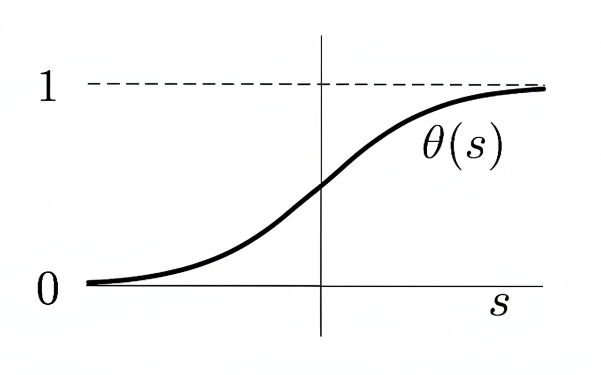
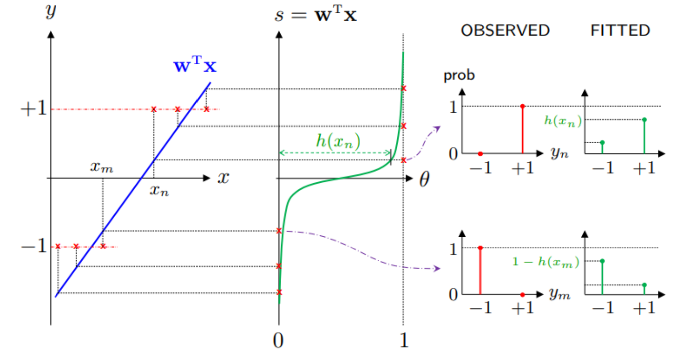

# Logistic regression

앞서 살펴본 기계학습 방법의 hypothesis function은 다음과 같다.

- Linear classification: $h(x) = \text{sign}(w^T x)$
- Linear regression: $h(x) = w^T x$

Logistic regression은 다음과 같다. 여기서 $\theta$는 logistic function이다.

- Logistic regression: $h(x) = \theta(w^T) x$

## Logistic function

Logistic function $\theta$는 다음과 같은 함수다. Sigmoid function이라고도 한다.

$$
\theta(s) = \frac{1}{1+e^{-s}}
$$

이 함수는 뒤에서 사용할 중요한 성질을 가진다.

$$
1 - \theta(s) = \theta(-s)
$$

## Big picture

Logistic regression의 큰 그림을 보자. 입력 데이터 $x$에 대해 먼저 linear하게 $s=w^Tx$를 계산하면, $s$를 logistic function에 대입해 0과 1로 smooth하게 분류한다. 이는 곧 확률로 볼 수 있다.

$$
\mathbb{P}[y=+1|x] = h(x) = \theta(w^Tx)
$$

반대로 $y=-1$일 확률은 1에서 뺀 값이다.

$$
h(-x) = \theta(-w^Tx) = 1 - \theta(w^Tx) = 1 - h(x)
$$

이를 합쳐서 쓰면 다음과 같다.

$$
\begin{split}
P(y|x) &= h(x)^{\llbracket y=+1 \rrbracket} + (1-h(x))^{\llbracket y=-1 \rrbracket}\\
       &= h(x)^{\llbracket y=+1 \rrbracket} + h(-x)^{\llbracket y=-1 \rrbracket}\\
       &= h(yx)\\
       &= \theta(yw^Tx)
\end{split}
$$

## Error measure

Logistic regression도 학습을 위해 error를 정의해야 한다. Linear regression에서 했던 것 처럼 square error로 $E_{in}$을 계산하는 measure 식은 다음과 같다.

$$
E_{in}(h) = \frac{1}{N} \sum^N_{n=1} \left( h(x_n) - \frac{1}{2}(1+y_n) \right)^2
$$

하지만 이 식은 최소화하기 어렵다. 그래서 우리는 convex해서 최소화하기 쉬운 cross-entropy measure를 이용한다.

$$
E_{in}(h) = \frac{1}{N} \sum^N_{n=1} \ln{\left( 1 + e^{-y_n w^T x_n} \right)}
$$

이 error measure를 유도하는 방법은 두 가지가 있다.

## Likelyhood

첫 번째 유도 방법은 likelyhood를 이용하는 것이다. 데이터가 예측값과 일치할 확률은 앞서 구했다. 이 확률이 likelyhood이다. 

$$
P(y|x) = \theta(y w^T x)
$$

Error를 minimize하는 방향으로, 즉 모든 데이터가 예측값과 일치할 확률을 계산해서 이를 maximize하면 된다. 

$$
P(y_1|x_1)P(y_2|x_2)\cdots P(y_N|x_N) = \prod^N_{n=1}P(y_n|x_n)
$$

$-$를 붙여 minimize 하는 식으로 만들고, 계산의 편의를 위해 $\ln$을 붙이고 $N$으로 나눈다. 앞에서 구한 $P(y|x)$에 대한 식을 대입하면 다음과 같이 유도할 수 있다.

$$
\begin{split}
E_{in}(w) &= -\frac{1}{N} \ln{\left( \prod^N_{n=1}P(y_n|x_n) \right)}\\
          &= \frac{1}{N} \sum_{n=1}^N \ln{\frac{1}{P(y_n|x_n)}}\\
          &= \frac{1}{N} \sum^N_{n=1} \ln{\left( 1 + e^{-y_n w^T x_n} \right)}
\end{split}
$$

## Cross entropy

두 번째 유도 방법은 cross entropy의 정의를 이용하는 것이다. 둘 중 하나의 값을 내보내는 binary outcome 확률분포(PMF) $\{p,1-p\}$와 $\{q,1-q\}$가 있을 때, 둘의 "차이 함수"라고 볼 수 있는 cross entropy는 다음과 같다.

$$
p \log{\frac{1}{q}} + (1-p)\log{\frac{1}{1-q}}
$$

이 식을 어떻게 사용할까? Data point $(x_n,y_n)$에 대해 $p = \llbracket y_n = +1 \rrbracket$, $q=h(x_n)$로 설정한다. 즉 $p$에 대한 확률분포가 실제값이고 이를 관측해 $q$에 대한 분포로 fitting 한다. 이 차이 함수를 minimize하면 예측값이 실제값에 가까워져 학습이 가능하다. 이를 모든 data point에 대해 합친 값이 cross entropy loss이다.

$$
E_{in}(w) = \sum_{n=1}^N \left\{ \llbracket y_n = +1 \rrbracket \log{\frac{1}{h(x_n)}} + \llbracket y_n = -1 \rrbracket \log{\frac{1}{1-h(x_n)}}   \right\}
$$

이 cross entropy loss를 최소화하는 작업이 첫 번째 방법인 maximum likelyhood와 동치여야 한다.

$$
\begin{split}
E_{in}(w) &= -\log \left\{ \prod_{n=1}^N P(y_n | x_n)  \right\} \\
          &=  -\log \left\{ \prod_{n=1}^N h(x_n)^{\llbracket y_n = +1 \rrbracket} (1-h(x_n))^{\llbracket y_n = -1 \rrbracket}  \right\} \\
          &= \sum_{n=1}^N \left\{ \llbracket y_n = +1 \rrbracket \log{\frac{1}{h(x_n)}} + \llbracket y_n = -1 \rrbracket \log{\frac{1}{1-h(x_n)}}   \right\}
\end{split}
$$

정리하면 $P(y|x)$에 $-\log{\prod}$를 해서 likelyhood를 계산하면 cross entropy 꼴이 되어 근본적으로 같은 error measure임을 확인할 수 있다.