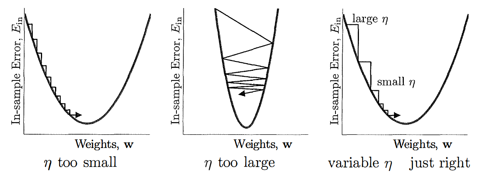
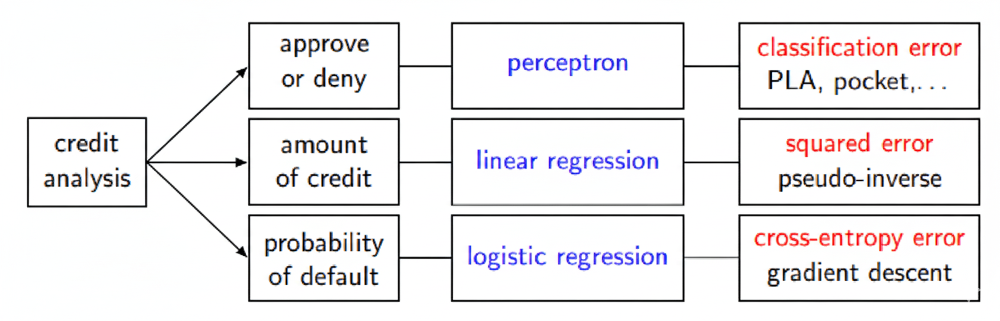

# Gradient descent

앞서 logistic regression error $E_{in}$을 구했다. 이는 weight $w$에 따른 함수이다.

$$
E_{in}(w) = \frac{1}{N} \sum^N_{n=1} \ln{\left( 1 + e^{-y_n w^T x_n} \right)}
$$

이번에는 이를 최소화하는 방법을 알아보자. 

## Calculating gradient

함수는 gradient가 0일 때 최솟값을 가진다.

$$
\begin{split}
\nabla E_{in}(w) &= -\frac{1}{N} \sum^N_{n=1} \frac{y_n x_n}{1 + e^{y_n w^T x_n}} \\
                 &= -\frac{1}{N} \sum^N_{n=1} y_n x_n \theta(-y_n w^T x_n) = 0
\end{split}
$$

Linear regression에서는 closed-form solution을 찾을 수 있었다. 하지만 이 식은 analytic solution을 찾을 수 없다. 따라서 iterative하게 solution을 찾아야 한다.

## Gradient descent

Iterative하게 learning rate $\eta$ 만큼씩 $E_{in}$를 줄이자.

$$
w(t+1) = w(t) + \eta \hat v
$$

Iteration 마다 차이는 다음과 같다.

$$
\begin{split}
\Delta E_{in} &= E_in(w(t+1)) - E_in(w(t)) \\
              &= E_in(w(t) + \eta ) - E_in(w(t)) \\
              &= \eta \nabla E_{in} (w(t))^T \hat v + O(\eta^2)\\
              &\leq -\eta \lVert \nabla E_{in} (w(t)) \rVert 
\end{split}
$$

등호 성립 조건은 다음과 같다.

$$
\hat v = - \frac{\nabla E_{in} (w(t))}{\lVert \nabla E_{in} (w(t)) \rVert }
$$

최소화하는 최적의 방향은 negative gradient 방향임을 알 수 있다. Iteration마다 $\hat v_t$로 방향이 업데이트 된다. 

## Algorithm

Gradient descent algorithm은 다음과 같다.

- Initialize weights $w(0)$
- for $t = 0, 1, 2, \cdots$
  - Compute $g_t = \nabla E_{in}(w(t))$
  - Set direction $v_t = -g_t$
  - Update weights $w(t+1) = w(t) + \eta v_t$
  - Iterate until stop

이때 learning rate $\eta$가 중요하다. 그림과 같이 너무 작으면 최솟값 도달에 오래 걸리고, 너무 크면 잘 도달하지 못하고 진동할 수 있다. 초반에는 크게, 후반에는 작게 하는 전략이 최솟값에 수렴하기 좋다.

Gradient descent를 terminate 하는 시점은 아래 셋 중 하나일 때다.
- 미리 정해둔 iteration 상한을 초과할 때
- gradient size가 충분히 작을 때
- error가 충분히 작을 때

## Summary

지금까지 linear classification, linear regression, logistic regression의 세 가지 linear model을 알아봤다. 세 가지 model은 문제마다 사용하는 상황이 다르다. Linear classification(perceptron)은 이분법적으로 두 가지 케이스로 나누는 경우에 사용한다. Linear regression은 0부터 1까지의 "점수"를 매겨 정도를 측정하는 경우에 사용한다. Logistic regression은 이분법적으로 나누되, 확률을 계산하여 옳은 정도를 표현한다. 문제 상황에 따라 적합한 모델을 사용하는 것이 중요하다.

