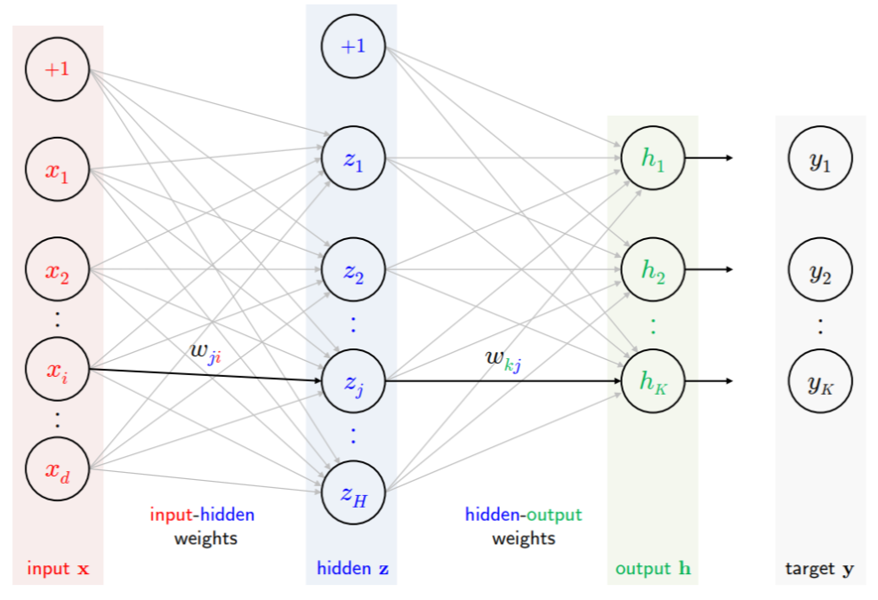
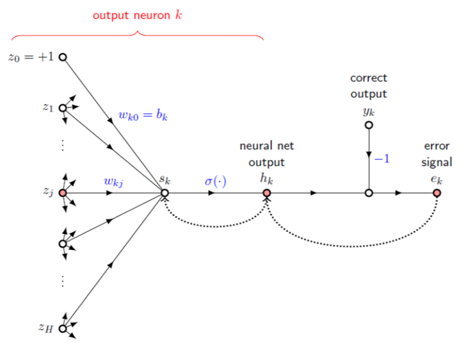
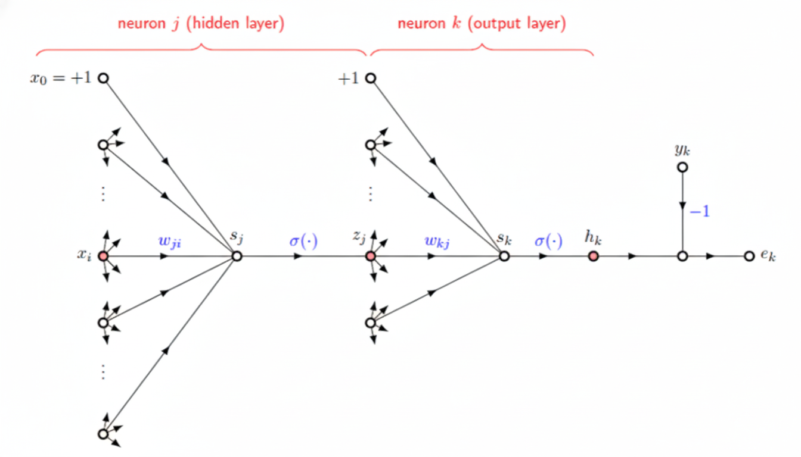
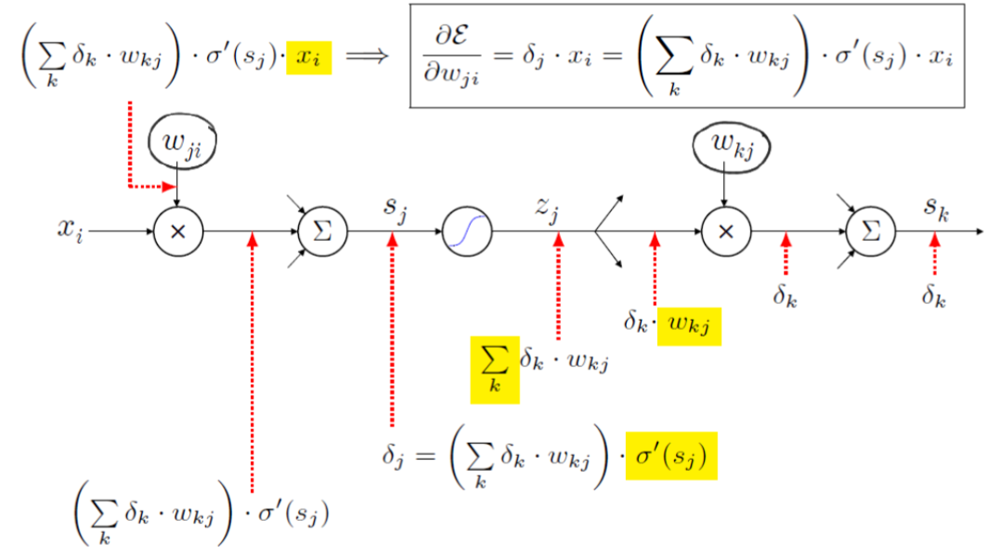
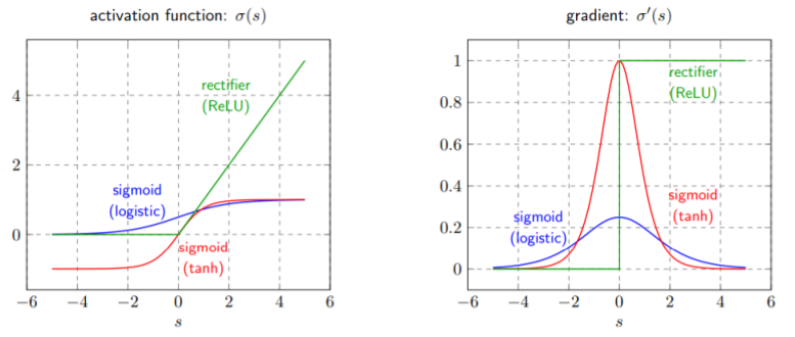

# Back propagation

이제는 linear model에서 한 단계 더 나아간 Neural Network를 다룰 차례다. 더 복잡한 데이터와 함수를 처리할 수 있게 된다. 

## Artificial Neural Network

Artificial neural network(ANN)은 다른 말로 multilayer perceptron(MLP)라고도 한다. 앞서 살펴본 logistic regression은 이분법적으로 두 가지의 경우의 수가 있었다면, ANN의 경우 2개 이상의 결과를 가지는 경우에 대해서도 사용할 수 있다. Logistic이 동전을 던지는 것이었다면, k-class softmax function은 주사위를 던지는 것이라 보면 된다. 

$$
\sigma \ : \ \mathbb{R}^K \rightarrow \mathbb{R}^K 
$$
$$
\sigma(h)_j = \frac{e^{h_j}}{\sum_{k=1}^K e^{h_k}}
$$

Error measure를 찾아보자. 나올 수 있는 경우의 수(주사위의 면 수)를 $k$, 데이터의 수(주사위의 개수)를 $n$으로 두자. 먼저 원소 하나에 대해, k번째 output의 error signal은 다음과 같다.

$$
e_k = h_k - y_k
$$

$n$번째 데이터 하나인 $(x_n, y_n)$에 대한 error energy는 각 원소들의 error에 대한 제곱합으로 나타난다.

$$
\mathcal{E}_n = \frac{1}{2} \sum_{k=1}^K e^2_{k,n}
$$

이제 모든 데이터 $\mathcal{D} = \{(x_1, y_1), \cdot (x_N, y_N)\}$에 대한 mean-squared error는 다음과 같다.

$$
\mathcal{E}_{\mathcal{D}} = \frac{1}{N} \sum_{n=1}^N \mathcal{E}_n = \frac{1}{2N} \sum_{n=1}^N \sum_{k=1}^K e^2_{k,n}
$$

이 값이 MLP의 error measure이다. 우리는 $\mathcal{E}_{\mathcal{D}}$를 최소화하는 $w$를 찾고 싶다. 앞선 모델들과 마찬가지로 gradient descent method를 사용하자.

## Back propagation

MLP가 어떻게 생겼는지 보자. 기본의 linear model들은 input $x$들에 대해 weights가 적용되어 output $h$가 나왔는데, MLP의 경우 hidden layer가 추가된다. 

Hidden과 output 사이를 output layer, Input과 hidden 사이를 hidden layer(input layer)라고 한다. 여기에 gradient descent method를 어떻게 사용할까? Gradient descent는 예측값과 실제값의 차이인 error로부터 weight를 조정하는 과정이다. MLP의 output과 target을 비교해 error를 계산하고 그 앞 layer의 weight들을 조정하고, 더 앞 layer의 weight를 계속 조정해서 "뒤에서 앞으로" 전파시키는 방법을 back propagation이라고 한다.

## Output layer

뒤쪽 output layer를 먼저 살펴보자.

Neural net output $h_k$에다 correct output $y_k$에 $-1$를 곱하고 더해 error signal $e_k$를 내보낸다. $h_k$는 각 $z_j$에 weight $w_{kj}$로 선형결합한 $s_k$를 softmax function에 통과시킨 결과다. 

Output layer의 weight를 조정해 back propagation을 하자. Learning rule은 error의 변화량에 대해 음의 값이므로 다음과 같다.

$$
\Delta w_{kj} = - \eta \cdot \frac{\partial \mathcal{E}}{\partial w_{kj}}
$$

Error measure를 weight로 미분한 "변화량"을 sensitivity factor라 한다. $s_k$를 $w_{kj}$로 미분한 값은 $z_j$이므로 chain rule에 의해 다음과 같다.

$$
\frac{\partial \mathcal{E}}{\partial w_{kj}} = \frac{\partial \mathcal{E}}{\partial s_k} \cdot z_j = \delta_k \cdot z_j
$$

이때 $\delta_k$를 delta error라 한다. 

$$
\delta_k = \frac{\partial \mathcal{E}}{\partial s_k} = e_k \cdot \sigma ' (s_k)
$$

결론적으로 learning rule은 다음과 같다.

$$
\Delta w_{kj} = - \eta \cdot \delta_k \cdot z_j
$$

따라서 $w_{kj}$에 대한 변화시킬 값을 얻어냈다.

## Hidden layer

다음은 그 앞의 hidden layer이다. 

Output layer와 같은 방법으로 learning rule을 계산한다.

$$
\Delta w_{ji} = - \eta \cdot \frac{\partial \mathcal{E}}{\partial w_{ji}}
$$

$$
\frac{\partial \mathcal{E}}{\partial w_{ji}} = \frac{\partial \mathcal{E}}{\partial s_j} \cdot x_i = \delta_j \cdot x_i
$$

Delta error $\delta_j$는 앞의 output layer의 결과와 합쳐져 다음과 같이 계산된다.

$$
\delta_j = \frac{\partial \mathcal{E}}{\partial s_j} = \sigma ' (s_j) \cdot \sum_k w_{kj}\delta_k
$$

정리하면 다음과 같다.

$$
\Delta w_{kj} = - \eta \cdot \delta_j \cdot x_i
$$

## Algorithm

다음과 같은 알고리즘으로 back propagation을 시행한다.

- 하나의 input $x_i$ 선택
  - forward: $z$, $h$ 계산
  - backward: $\delta$ 계산 $\rightarrow$ 모든 $\partial \mathcal{E} / \partial w_{ij}$ 계산 가능
  - weight update
- 이 과정을 여러 번 반복

Forward 과정은 weight들을 곱하고 더해서 sigmoid에 통과시키는 것의 반복이다. Backward는 weight 수정이다. 여기서 핵심 단계는 weight의 수정 정도, sensitivity factor인 $\partial \mathcal{E} / \partial w_{ij}$ 계산 과정이다. 

$$
\Delta w = - \eta \cdot \frac{\partial \mathcal E}{\partial w}
$$

다이어그램으로 나타내면 다음과 같다.

단계별로 풀어서 보자.

Sensitivity factor는 입력값 $x_i$에 $\delta_j$만큼 곱한 값이다. 

$$
\frac{\partial \mathcal E}{\partial w} = \delta_j \cdot x_i
$$

이 $\delta_j$는 이후 layer들까지 다 계산된 weight와 delta 값들을 이용해 역으로 계산된다.

$$
\delta_j = \left( \sum_k \delta_k \cdot w_{kj} \right) \cdot \sigma'(s_j)
$$

$w_{kj}$는 다시 sensitivity factor를 이용해 수정되며, 이는 입력값 $z_j$에 $\delta_k$만큼 곱한 값이다. Layer의 수 만큼 역으로 계속 수정된다.

## Vanishing gradient problem

이는 weight들을 뒤에서부터 하나씩 수정하는 좋은 알고리즘이지만 한 가지 문제가 있다. Activation function(여기서는 sigmoid)에 들어가는 값이 매우 크거나 작은 경우에도 작동해야 한다. 하지만 sigmoid는 미분한 값이 양 끝단에서 0으로 사라진다. 이러한 이유로 사라지지 않는 ReLU 함수를 activation function으로 많이 사용한다.

